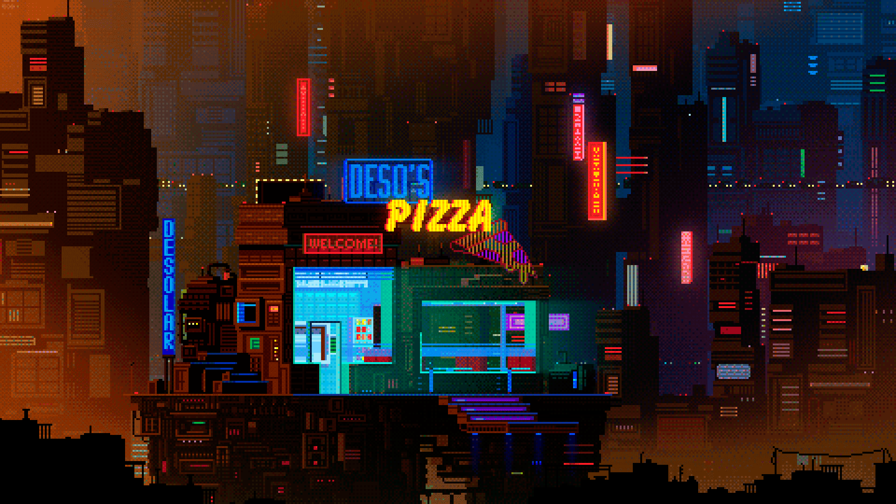

<p align="center">
  
</p>

<br>

<p align="center">
  
</p>

<p align="center">
  
  
  
</p>

---

<h1 align="center">PRANIT SAUNDANKAR</h1>

<p align="center">
  <b>AI • ML • DL • COMPUTER VISION • LLM • RAGs • Agentic AI</b>
</p>

<br>

```bash
AI/DS student building intelligent systems,
immersive AI applications,
and futuristic ML-powered experiences.

Current Focus:
• Deep Learning
• Computer Vision
• LLMs & RAG
• QLoRA Fine-Tuning
• Recommendation Systems
• Agentic AI Workflows
• AI Infrastructure
```

---

# SYSTEM STATUS

```yaml
STATUS: ONLINE

CURRENT OPERATIONS:
  - Multimodal AI Systems
  - QLoRA Fine-Tuning Pipelines
  - Vision-Language Applications
  - Recommendation Engines
  - RAG + Agent Architectures
  - Interactive AI Interfaces

UPTIME: STABLE
SIGNAL: STRONG
ENVIRONMENT: RAIN-SOAKED MEGACITY
```

---

# FEATURED PROJECTS

## Mistral QLoRA Fine-Tuning

> Fine-tuning vs Prompt Engineering on Mistral-7B with full ablation studies and statistical significance testing using QLoRA on a Kaggle T4 GPU.

<p align="center">
  
  
  
  
  
</p>

<br>

## CarbonScoreX

> AI-powered Carbon Credit Exchange platform focused on transparent trading, smart compliance scoring, and greenwashing detection.

<p align="center">
  
  
  
  
</p>

<br>

## Neural Style Transfer CV App

> Neural Style Transfer web application built with PyTorch + Streamlit for transforming images into stylized artwork.

<p align="center">
  
  
  
  
</p>

<br>

## Book Recommender AI System

> Personalized recommendation engine powered by Keras Autoencoders with collaborative filtering and intelligent recommendation pipelines.

<p align="center">
  
  
  
  
</p>

---

# TECH STACK

## MACHINE LEARNING / AI

<p align="center">
  
</p>

<p align="center">
  
  
  
  
  
</p>

<br>

## DEVELOPMENT / INFRASTRUCTURE

<p align="center">
  
</p>

<br>

## LANGUAGES

<p align="center">
  
</p>

---

# GITHUB ANALYTICS

<p align="center">
  

  
</p>

<p align="center">
  
</p>

---

# ACTIVE DOMAINS

<p align="center">
  
  
  
  
</p>

<p align="center">
  
  
  
</p>

---

# CURRENTLY LEARNING

```txt
> Advanced LLM Systems
> Scalable RAG Architectures
> QLoRA Optimization
> Multimodal AI Pipelines
> Agent Memory Systems
> Deep Learning Research Workflows
```

---

# CONTRIBUTION GRAPH

<p align="center">
  
</p>

---

# NETWORKS

<p align="center">
  <a href="https://github.com/Pranitttt64">
    
  </a>

  <a href="[https://www.linkedin.com/](https://www.linkedin.com/in/pranit-saundankar-68532328b/)">
    
  </a>

  <a href="[https://www.kaggle.com/](https://www.kaggle.com/pranitsaundankar)">
    
  </a>
</p>

---

<p align="center">
  
</p>

---

```txt
Building intelligent systems inside
rain-soaked futuristic worlds.

END OF TRANSMISSION.
```

